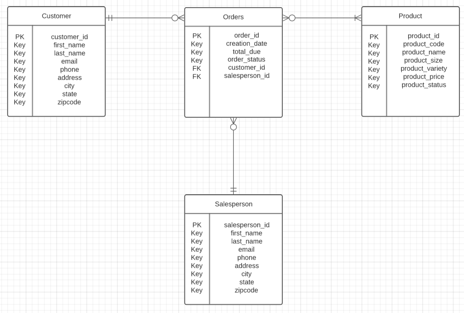

# Introduction
The JDBC learning app allows a user to establish a connection between a java application and an RDBMS.
The basic flow of the JDBC app follows a simple process of mounting the driver and creating a connection. From that connection
comes executing SQL statements, and then commit/rollback and finally close the connection. The application consists of multiple
java classes each with its own function of providing the methods and connections that allow the user to 
access database elements with SQL queries pre-defined within the Customer DAO class.

Technologies:
- Java
- IntelliJ
- JDBC
- PSQL
- Maven
- RDBMS

# Implementation
The implementation of the JDBC app consists of the Customer class, the Database connection class, JDBC executor, Customer DAO.
The Customer class consists of methods and getters/setters. The database connection class provides the host url used to connect the 
java code to RDBMS. The JDBC executor is used to set the information of the customer with the set methods.
Lastly, Customer DAO is used to predefine SQL statements which are then executed via the code with which
users can connect via psql and see changes within the database.

## ER Diagram

## Design Patterns
DAO is known as Data Access Object, and it allows us to separate low level data, operations or methods
from high level services. DAOs are useful in the sense that it can hide from the application all the complexity
of performing CRUD operations. For this project, the CustomerDAO class contains low-level code for CRUD operations for the 
customer table which are then used in SQL statements for the user make any sort of changes or retrievals.

The Repository design patterns uses repositories as classes to encapsulate the logic of accessing data sources. It is 
similar to a DAO because it deals with hiding queries just like a DAO. The repository can also use a DAO to fetch from
a database and populate a domain object.

# Test
I tested the JDBC code from the IntelliJ IDE as well as querying from the database
via psql.
